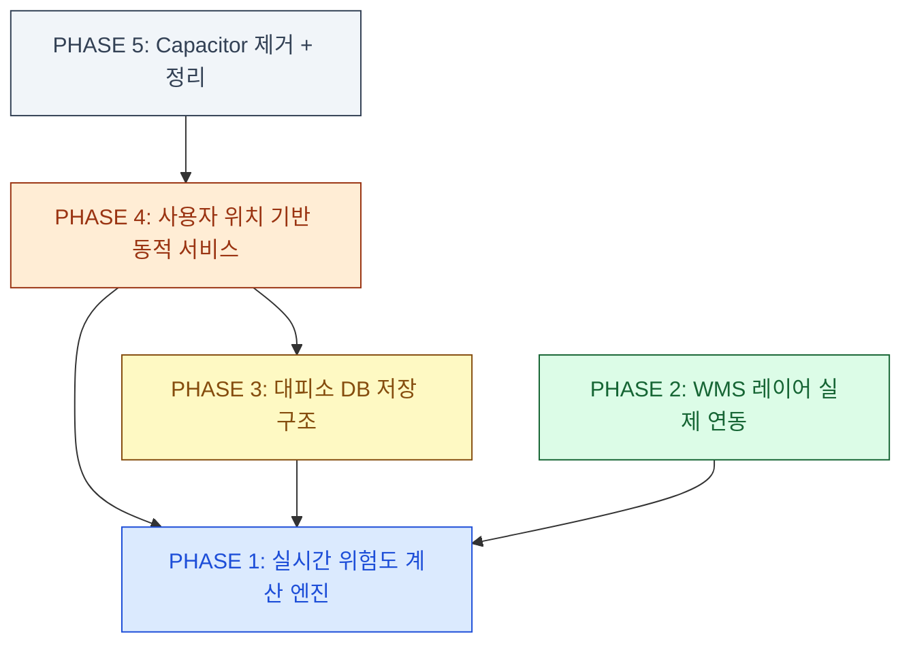

# 침수퇴로 AI — 상세 Implementation Plan

> 이 문서만으로 계획된 내용을 그대로 구현할 수 있도록 파일 경로, 수정 내용, 수식, 검증 방법을 모두 포함합니다.

---

## 목표

현재 시나리오 프리셋/Mock 데이터에 의존하는 5개 영역을 **실제 API + 논문 기반 계산 엔진**으로 교체하고, **사용자 위치 기반 동적 서비스**로 전환합니다.

---

## PHASE 1: 논문 기반 실시간 위험도 계산 엔진

> **목표**: 시나리오 프리셋에 의존하던 위험도를 실시간 데이터(기상·재난문자·WMS·센서)를 종합하여 자동 계산하는 엔진으로 교체

### 1.1 이론적 배경 (가중합 위험도 모델)

논문에서 사용하는 **다기준 가중합 모델(Weighted Sum Model)** 기반으로 침수 위험도를 산정합니다.

$$Risk = \sum_{i=1}^{n} (w_i \times x_i), \quad \sum w_i = 1.0$$

#### 위험 인자 및 가중치 설계

| 인자 ($x_i$)    | 가중치 ($w_i$) | 최대 점수 | 데이터 소스                              | 산정 기준                                  |
| --------------- | -------------: | --------: | ---------------------------------------- | ------------------------------------------ |
| 강우 위험       |           0.30 |      30점 | 기상청 초단기실황/단기예보               | 한계강우량 비율 $R_{real}/R_{limit}$       |
| 침수흔적 중첩   |           0.25 |      25점 | 생활안전지도 WMS 침수흔적도              | 사용자 위치 2km 반경 내 침수흔적 존재 여부 |
| 하천범람 위험   |           0.20 |      20점 | 생활안전지도 WMS 하천범람지도 + 수위센서 | 범람 위험지역 중첩 + 수위 임계치           |
| 재난문자 해당   |           0.15 |      15점 | 행안부 긴급재난문자 API                  | 해당 지역 키워드 매칭                      |
| 지하차도/저지대 |           0.05 |       5점 | 대피소·경로 데이터                       | 경로 내 지하차도 통과 여부                 |
| 교통통제/혼잡   |           0.05 |       5점 | 경로 API 응답                            | 통제 구간 존재 여부                        |

#### 한계강우량 기반 강우 점수 산정 수식

$$Score_{weather} = \min\left(30, \; 30 \times \frac{R_{real}}{R_{limit}}\right)$$

도시 지역 한계강우량 $R_{limit}$은 지역별로 다르며, MVP에서는 행안부 기준 **시간당 30mm**를 기본값으로 사용합니다:

| 강우량 (mm/h) | $R_{real}/R_{limit}$ | 강우 점수 | 비고                   |
| ------------: | -------------------: | --------: | ---------------------- |
|           0~4 |               0~0.13 |       0~4 | 안전                   |
|          5~14 |            0.17~0.47 |      5~14 | 주의 구간              |
|         15~29 |            0.50~0.97 |     15~29 | 경계 구간              |
|         30~49 |             1.0~1.63 |  30 (cap) | 심각 — 한계강우량 초과 |
|           50+ |                1.67+ |  30 (cap) | 심각 — 호우특보급      |

> [!NOTE]
> 예보 강우량도 동일 수식 적용. 현재 강우와 예보 중 **큰 값**을 채택합니다.
> 기상특보(호우주의보/경보) 존재 시 최소 24점 보장.

#### 위험도 등급 판정 (기존 `scoreToLevel` 유지)

| 총 점수 | 등급     | 코드       |
| ------: | -------- | ---------- |
|    0~24 | 안전     | `SAFE`     |
|   25~49 | 주의     | `WATCH`    |
|   50~74 | 경계     | `WARNING`  |
|  75~100 | 심각     | `CRITICAL` |
|     < 0 | 정보없음 | `UNKNOWN`  |

### 1.2 구현 상세

#### [MODIFY] [calculateRiskScore.ts](file:///c:/Users/dbcdk/Desktop/제4회 재난안전데이터 활용 창업경진대회/src/lib/risk/calculateRiskScore.ts)

현재 이미 `calculateRiskScore()` 함수와 `RiskCalculationInput` 타입이 존재합니다. 수정 사항:

1. **강우 점수 계산을 한계강우량 비율 기반으로 변경**
   - 현재: 하드코딩된 단계별 점수 (50mm→30, 30mm→26, 15mm→20, 5mm→10)
   - 변경: `Score = min(30, 30 × R_real / R_limit)` 선형 보간
   - `R_limit` 기본값 30mm/h, 향후 지역별 DB 조회로 확장 가능

```typescript
// 변경 전
const rainScore = currentRain >= 50 ? 30 : currentRain >= 30 ? 26 : ...

// 변경 후
const R_LIMIT_DEFAULT = 30; // mm/h (도시 지역 한계강우량)
const ratio = Math.max(currentRain, forecastRain) / R_LIMIT_DEFAULT;
const rainScore = Math.min(30, Math.round(30 * ratio));
// 기상특보 존재 시 최소 24점 보장
const weatherScore = clamp(Math.max(rainScore, alertLevel ? 24 : 0), 0, 30);
```

2. **WMS 중첩 판정을 boolean에서 점수화로 확장**
   - `floodTrace: boolean` → `floodTraceOverlap: number` (0~100%, WMS GetFeatureInfo 결과)
   - `Score_floodTrace = min(25, round(25 × overlapRatio))`

3. **센서 기반 하천범람 점수 보강** (기존 로직 유지, 가중치만 조정)

#### [NEW] [useRiskAssessment.ts](file:///c:/Users/dbcdk/Desktop/제4회 재난안전데이터 활용 창업경진대회/src/hooks/useRiskAssessment.ts)

기상·재난문자·WMS 데이터를 종합하여 `calculateRiskScore`를 호출하는 통합 hook:

```typescript
export function useRiskAssessment(origin: LatLng) {
  const { result: weatherResult } = useWeather({ origin });
  const { result: disasterResult } = useDisasterMessages({ region: reverseGeocode(origin) });
  const { floodTraceOverlap, riverFloodOverlap } = useWmsOverlap(origin);

  const input: RiskCalculationInput = {
    weather: weatherResult.data,
    forecast: weatherResult.data, // 예보도 동일 API에서 추출
    floodTrace: floodTraceOverlap > 0,
    floodTraceOverlap,
    riverFlood: riverFloodOverlap > 0,
    disasterMessages: disasterResult.data ?? [],
    hasUnderpass: false, // 경로 선택 시 별도 판정
    trafficControl: false,
    failedDataCount: countFailedApis(weatherResult, disasterResult),
  };

  const breakdown = calculateRiskScore(input);

  // Zustand 스토어에 실시간 반영
  const { setRiskAssessment } = useScenario();
  useEffect(() => {
    setRiskAssessment(breakdown);
  }, [breakdown.total]);

  return breakdown;
}
```

#### [MODIFY] [scenario.ts](file:///c:/Users/dbcdk/Desktop/제4회 재난안전데이터 활용 창업경진대회/src/store/scenario.ts)

- 시나리오 프리셋은 **시연/디버그 전용**으로 보존
- `setRiskAssessment` 액션이 이미 존재하므로 그대로 활용
- 홈 화면 진입 시 `useRiskAssessment`가 자동으로 스토어 업데이트

#### [MODIFY] [index.tsx](file:///c:/Users/dbcdk/Desktop/제4회 재난안전데이터 활용 창업경진대회/src/routes/index.tsx) (홈 화면)

- `useRiskAssessment(origin)` 호출 추가
- 기존 `riskLevel`은 스토어에서 자동 갱신되므로 UI 변경 최소화

### 1.3 검증

- [ ] `calculateRiskScore` 유닛 테스트: 강우량 0~80mm 범위에서 예상 점수 일치 확인
- [ ] 한계강우량 비율 경계값 테스트: 0, 15, 30, 50, 80mm/h
- [ ] `useRiskAssessment` 통합 테스트: mock 기상/재난문자/WMS 응답 조합
- [ ] 기존 `risk.test.ts` 통과 확인

---

## PHASE 2: WMS 레이어 실제 연동 (침수흔적도/하천범람지도)

> **목표**: Mock `RISK_ZONES`를 생활안전지도 WMS 실제 데이터로 교체

### 2.1 현재 상태

- [wms.ts](file:///c:/Users/dbcdk/Desktop/제4회 재난안전데이터 활용 창업경진대회/src/lib/map/wms.ts): WMS URL 빌더 **이미 구현** (침수흔적도 `IF_0092`, 하천범람지도 `IF_0089`)
- [wmsConfig.ts](file:///c:/Users/dbcdk/Desktop/제4회 재난안전데이터 활용 창업경진대회/src/lib/api/wmsConfig.ts): `VITE_SAFEMAP_SERVICE_KEY` 환경변수 기반 **이미 구현**
- [NaverMap.tsx](file:///c:/Users/dbcdk/Desktop/제4회 재난안전데이터 활용 창업경진대회/src/components/map/NaverMap.tsx): WMS 오버레이 렌더링 로직 확인 필요
- [useWmsLayers.ts](file:///c:/Users/dbcdk/Desktop/제4회 재난안전데이터 활용 창업경진대회/src/hooks/useWmsLayers.ts): 빈 배열 반환 중 (키 미설정)

### 2.2 구현 상세

#### [MODIFY] [.env](file:///c:/Users/dbcdk/Desktop/제4회 재난안전데이터 활용 창업경진대회/.env)

```
VITE_SAFEMAP_SERVICE_KEY=<생활안전지도 API 서비스키>
```

> [!IMPORTANT]
> 생활안전지도 API 키를 https://www.safemap.go.kr 에서 발급받아야 합니다.

#### [NEW] [useWmsOverlap.ts](file:///c:/Users/dbcdk/Desktop/제4회 재난안전데이터 활용 창업경진대회/src/hooks/useWmsOverlap.ts)

사용자 위치 기준으로 WMS GetFeatureInfo를 호출하여 침수흔적/하천범람 중첩 여부를 판정:

```typescript
export function useWmsOverlap(origin: LatLng) {
  return useQuery({
    queryKey: ["wms-overlap", origin.lat.toFixed(4), origin.lng.toFixed(4)],
    staleTime: API_CACHE_TTL_MS.WMS_METADATA,
    queryFn: async () => {
      const serviceKey = getClientSafeMapServiceKey();
      if (!serviceKey) return { floodTraceOverlap: 0, riverFloodOverlap: 0 };

      // 사용자 위치 중심 500m 반경 BBox
      const bounds = createBoundsFromCenter(origin, 500);
      const [floodTrace, riverFlood] = await Promise.allSettled([
        fetchWmsGetFeatureInfo({ layer: "A2SM_FLUDMARKS", bounds, point: origin, serviceKey }),
        fetchWmsGetFeatureInfo({ layer: "A2SM_FLOODFOVRRISK1", bounds, point: origin, serviceKey }),
      ]);

      return {
        floodTraceOverlap: floodTrace.status === "fulfilled" ? floodTrace.value.overlap : 0,
        riverFloodOverlap: riverFlood.status === "fulfilled" ? riverFlood.value.overlap : 0,
      };
    },
  });
}
```

#### [NEW] [wmsFeatureInfo.ts](file:///c:/Users/dbcdk/Desktop/제4회 재난안전데이터 활용 창업경진대회/src/lib/api/wmsFeatureInfo.ts)

WMS GetFeatureInfo API 호출 및 파싱:

```typescript
export async function fetchWmsGetFeatureInfo(params: {
  layer: string;
  bounds: WmsBounds;
  point: LatLng;
  serviceKey: string;
}): Promise<{ overlap: number; features: unknown[] }> {
  const url = new URL("https://www.safemap.go.kr/openapi2/IF_0092_WMS");
  url.searchParams.set("service", "WMS");
  url.searchParams.set("request", "GetFeatureInfo");
  url.searchParams.set("version", "1.1.1");
  url.searchParams.set("layers", params.layer);
  url.searchParams.set("query_layers", params.layer);
  url.searchParams.set("srs", "EPSG:4326");
  url.searchParams.set("bbox", formatWmsBbox(params.bounds));
  url.searchParams.set("width", "256");
  url.searchParams.set("height", "256");
  url.searchParams.set("info_format", "application/json");
  // X, Y는 bbox 내 상대 좌표
  const { x, y } = latLngToPixel(params.point, params.bounds, 256, 256);
  url.searchParams.set("x", String(x));
  url.searchParams.set("y", String(y));
  url.searchParams.set("serviceKey", params.serviceKey);

  const res = await fetch(url.toString());
  const json = await res.json();
  const features = json.features ?? [];
  return { overlap: features.length > 0 ? 1 : 0, features };
}
```

#### [MODIFY] [NaverMap.tsx](file:///c:/Users/dbcdk/Desktop/제4회 재난안전데이터 활용 창업경진대회/src/components/map/NaverMap.tsx)

WMS 이미지 오버레이를 네이버 지도에 렌더링하는 로직이 이미 있는지 확인 후:

- `wmsLayers` prop이 비어있지 않으면 `naver.maps.GroundOverlay`로 WMS GetMap 이미지를 오버레이
- 지도 이동/줌 시 debounce로 WMS 이미지 갱신

#### [MODIFY] 홈·경로 화면에서 Mock `RISK_ZONES` 제거

- `RISK_ZONES` import를 WMS 실시간 데이터로 대체
- 위험구역 폴리곤은 WMS 레이어가 직접 렌더링하므로 **클라이언트 폴리곤 삭제**
- `routeRanking.ts`의 `riskZones` 파라미터는 WMS 중첩 판정 결과로 대체

### 2.3 검증

- [ ] `.env`에 테스트 키 설정 후 WMS GetMap 이미지 표시 확인
- [ ] WMS GetFeatureInfo 응답 파싱 테스트
- [ ] 키 미설정 시 graceful fallback (빈 오버레이 + 경고 배지)
- [ ] 기존 `wmsConfig.test.ts`, `wms.test.ts` 통과

---

## PHASE 3: 대피소 데이터 DB 저장 구조

> **목표**: Edge Function에서 행안부 API를 호출하여 Supabase DB에 저장하고, 클라이언트는 DB에서 조회

### 3.1 데이터 흐름 설계

```
[행안부 대피소 API] → [Supabase Edge Function: shelters-sync] → [Supabase DB: shelters 테이블]
                                                                        ↓
[클라이언트: useShelters hook] ← [Supabase Edge Function: shelters] ← [DB 조회]
```

### 3.2 구현 상세

#### [NEW] Supabase Migration: `create_shelters_table.sql`

```sql
-- 대피소 마스터 테이블
CREATE TABLE IF NOT EXISTS public.shelters (
  id TEXT PRIMARY KEY,                    -- 시설 고유 ID
  name TEXT NOT NULL,                     -- 시설명
  address TEXT NOT NULL,                  -- 주소
  lat DOUBLE PRECISION NOT NULL,          -- 위도
  lng DOUBLE PRECISION NOT NULL,          -- 경도
  capacity INTEGER NOT NULL DEFAULT 0,    -- 수용 인원
  status TEXT NOT NULL DEFAULT 'CHECK_REQUIRED',  -- OPERATING, CHECK_REQUIRED, EXCLUDED
  underground BOOLEAN NOT NULL DEFAULT FALSE,     -- 지하 시설 여부
  type TEXT NOT NULL DEFAULT '민방위대피시설',      -- 시설 유형
  source TEXT DEFAULT '행안부 API',        -- 데이터 출처
  synced_at TIMESTAMPTZ DEFAULT NOW(),    -- 마지막 동기화 시각
  created_at TIMESTAMPTZ DEFAULT NOW(),
  updated_at TIMESTAMPTZ DEFAULT NOW()
);

-- 위치 기반 조회를 위한 인덱스
CREATE INDEX IF NOT EXISTS idx_shelters_location ON public.shelters (lat, lng);
CREATE INDEX IF NOT EXISTS idx_shelters_status ON public.shelters (status);

-- RLS 정책: 모든 사용자가 읽기 가능, 관리자만 쓰기
ALTER TABLE public.shelters ENABLE ROW LEVEL SECURITY;
CREATE POLICY "shelters_read_all" ON public.shelters FOR SELECT USING (true);
CREATE POLICY "shelters_write_admin" ON public.shelters FOR ALL
  USING (auth.jwt() ->> 'role' = 'ops_admin');
```

#### [NEW] Supabase Edge Function: `shelters-sync/index.ts`

행안부 API에서 대피소 데이터를 가져와 DB에 upsert:

```typescript
// 주기적 호출 (Supabase cron 또는 수동)
Deno.serve(async (req) => {
  // 1. 행안부 대피소 API 호출 (기존 shelters Edge Function의 외부 API 호출 로직 재사용)
  const rawShelters = await fetchFromMoisApi(region);

  // 2. Shelter 타입으로 변환
  const shelters = rawShelters.map(parseMoisShelter);

  // 3. Supabase DB에 upsert
  const { error } = await supabaseAdmin.from("shelters").upsert(
    shelters.map((s) => ({
      id: s.id,
      name: s.name,
      address: s.address,
      lat: s.position.lat,
      lng: s.position.lng,
      capacity: s.capacity,
      status: inferShelterStatus(s),
      underground: s.underground,
      type: s.type,
      source: "행안부 API",
      synced_at: new Date().toISOString(),
    })),
    { onConflict: "id" },
  );

  return new Response(JSON.stringify({ synced: shelters.length, error }));
});
```

#### [MODIFY] Supabase Edge Function: `shelters/index.ts`

기존: 외부 API 직접 호출
변경: **DB에서 조회** (위치 기반 필터링)

```typescript
Deno.serve(async (req) => {
  const { lat, lng, radius = 5000 } = await req.json().catch(() => ({}));

  // PostGIS 없이 bounding box 근사 필터링
  const deltaLat = radius / 111320;
  const deltaLng = radius / (111320 * Math.cos(((lat ?? 37.5) * Math.PI) / 180));

  let query = supabaseAdmin.from("shelters").select("*");

  if (lat && lng) {
    query = query
      .gte("lat", lat - deltaLat)
      .lte("lat", lat + deltaLat)
      .gte("lng", lng - deltaLng)
      .lte("lng", lng + deltaLng);
  }

  const { data, error } = await query.order("name");

  // DB → 클라이언트 Shelter 타입으로 변환
  const shelters = (data ?? []).map((row) => ({
    id: row.id,
    name: row.name,
    address: row.address,
    position: { lat: row.lat, lng: row.lng },
    capacity: row.capacity,
    status: row.status,
    underground: row.underground,
    type: row.type,
  }));

  return new Response(JSON.stringify(shelters));
});
```

#### [MODIFY] [shelterApi.ts](file:///c:/Users/dbcdk/Desktop/제4회 재난안전데이터 활용 창업경진대회/src/lib/shelters/shelterApi.ts)

Edge Function 호출 시 사용자 위치 전달:

```typescript
export const fetchShelters = async (origin?: LatLng): Promise<Shelter[]> => {
  try {
    const { data, error } = await supabase.functions.invoke("shelters", {
      body: origin ? { lat: origin.lat, lng: origin.lng, radius: 5000 } : {},
    });
    if (!error && data?.length > 0) return data as Shelter[];
  } catch (err) {
    /* fallback */
  }

  // 기존 정적 JSON → Mock 순 fallback 유지
  // ...
};
```

#### [MODIFY] [useShelters.ts](file:///c:/Users/dbcdk/Desktop/제4회 재난안전데이터 활용 창업경진대회/src/hooks/useShelters.ts)

`fetchShelters(origin)` 호출에 origin 전달:

```typescript
const allShelters = await fetchShelters(origin);
```

### 3.3 검증

- [ ] Migration 실행 후 `shelters` 테이블 생성 확인
- [ ] `shelters-sync` Edge Function으로 대피소 데이터 DB 저장 확인
- [ ] `shelters` Edge Function에서 위치 기반 필터링 응답 확인
- [ ] 클라이언트에서 대피소 목록이 정상 표시되는지 확인
- [ ] DB 데이터 없을 시 기존 Fallback 동작 확인

---

## PHASE 4: 사용자 위치 기반 동적 서비스

> **목표**: "서울 강남구" 하드코딩을 사용자의 현재 위치/주소 기반으로 동적 전환

### 4.1 현재 하드코딩 지점

| 파일                                                                                                                              | 하드코딩 내용                              | 변경 방향                                       |
| --------------------------------------------------------------------------------------------------------------------------------- | ------------------------------------------ | ----------------------------------------------- |
| [mocks/data.ts](file:///c:/Users/dbcdk/Desktop/제4회 재난안전데이터 활용 창업경진대회/src/mocks/data.ts) `DEMO_CENTER`            | `{ lat: 37.4979, lng: 127.0276 }`          | 사용자 위치로 대체, 위치 미확보 시에만 fallback |
| [useDisasterMessages.ts](file:///c:/Users/dbcdk/Desktop/제4회 재난안전데이터 활용 창업경진대회/src/hooks/useDisasterMessages.ts)  | `region: "서울 강남구"`                    | 역 지오코딩 결과 사용                           |
| [help.tsx](file:///c:/Users/dbcdk/Desktop/제4회 재난안전데이터 활용 창업경진대회/src/routes/help.tsx)                             | `allowedProperNouns: ["서울 강남구", ...]` | 동적 지역명                                     |
| [ops/messages.tsx](file:///c:/Users/dbcdk/Desktop/제4회 재난안전데이터 활용 창업경진대회/src/routes/ops/messages.tsx)             | `region: "서울 강남구"`                    | 동적 지역명                                     |
| [calculateRiskScore.ts](file:///c:/Users/dbcdk/Desktop/제4회 재난안전데이터 활용 창업경진대회/src/lib/risk/calculateRiskScore.ts) | `"강남"` 키워드 매칭                       | 동적 지역명 키워드                              |

### 4.2 구현 상세

#### [NEW] [useReverseGeocode.ts](file:///c:/Users/dbcdk/Desktop/제4회 재난안전데이터 활용 창업경진대회/src/hooks/useReverseGeocode.ts)

사용자 좌표를 행정구역명으로 변환:

```typescript
export function useReverseGeocode(origin: LatLng) {
  const [region, setRegion] = useState("현재 위치");

  useEffect(() => {
    const service = window.naver?.maps.Service;
    if (!service?.reverseGeocode) return;

    service.reverseGeocode(
      { coords: new naver.maps.LatLng(origin.lat, origin.lng), orders: "legalcode" },
      (status, response) => {
        if (status !== service.Status?.OK) return;
        const area = response.v2?.results?.[0]?.region;
        if (area) {
          const name = `${area.area1?.name ?? ""} ${area.area2?.name ?? ""}`.trim();
          setRegion(name || "현재 위치");
        }
      },
    );
  }, [origin.lat, origin.lng]);

  return region;
}
```

#### [MODIFY] Zustand 스토어에 `region` 추가

```typescript
// scenario.ts에 추가
region: string;
setRegion: (r: string) => void;
```

#### [MODIFY] 하드코딩 지점 동적 전환

1. **홈 화면 (`index.tsx`)**: `useReverseGeocode(origin)` → `setRegion()` 스토어 업데이트
2. **재난문자 hook**: `region` 파라미터를 스토어에서 읽기
3. **AI 도움 화면**: `allowedProperNouns`를 동적 지역명 + 대피소명으로 구성
4. **담당자 안내문**: 스토어의 `region` 사용
5. **위험도 계산**: 재난문자 키워드 매칭을 동적 지역명 기반으로 변경

#### [MODIFY] `DEMO_CENTER` 역할 변경

- 이름을 `DEFAULT_CENTER`로 변경
- 위치 권한 미확보 + 주소 미입력 시에만 사용하는 **최후 fallback**으로 전환
- 스토어 초기값을 `null`로 변경하고, 위치 확보 시에만 origin 설정

### 4.3 검증

- [ ] 위치 허용 시 → 현재 위치 기준 지역명 표시 확인
- [ ] 위치 거부 → 주소 입력 → 해당 지역 기준으로 재난문자·대피소 조회 확인
- [ ] 강남구 외 지역 (예: 송파구, 관악구) 테스트
- [ ] 역지오코딩 실패 시 "현재 위치" 문구 표시 확인

---

## PHASE 5: Capacitor 제거 + 정리

> **목표**: 네이티브 앱 계획 없으므로 Capacitor 설정 제거, 불필요 코드 정리

### 5.1 구현 상세

#### [DELETE] [capacitor.config.ts](file:///c:/Users/dbcdk/Desktop/제4회 재난안전데이터 활용 창업경진대회/capacitor.config.ts)

#### [MODIFY] [package.json](file:///c:/Users/dbcdk/Desktop/제4회 재난안전데이터 활용 창업경진대회/package.json)

- `@capacitor/*` 관련 의존성이 있으면 제거

#### [MODIFY] Mock 데이터 정리

- [mocks/data.ts](file:///c:/Users/dbcdk/Desktop/제4회 재난안전데이터 활용 창업경진대회/src/mocks/data.ts):
  - `DEMO_CENTER` → `DEFAULT_CENTER`로 이름 변경
  - `RISK_ZONES` Mock 데이터 유지 (WMS 실패 시 fallback으로 활용)
  - `buildRoutes()` Mock 함수 유지 (경로 API 실패 시 fallback)
  - `SHELTERS` Mock 유지 (3단계 fallback 최후 수단)
  - `DATA_TIMESTAMP`를 `new Date().toISOString()`으로 변경하거나 각 API 응답 시각 사용

#### [MODIFY] 시나리오 프리셋 역할 정리

- [presets.ts](file:///c:/Users/dbcdk/Desktop/제4회 재난안전데이터 활용 창업경진대회/src/lib/scenario/presets.ts): 유지 (시연/디버그용)
- [AppHeader](file:///c:/Users/dbcdk/Desktop/제4회 재난안전데이터 활용 창업경진대회/src/components/layout/AppHeader.tsx): 시나리오 전환 UI가 있으면 "시연 모드" 라벨 추가

### 5.2 검증

- [ ] `capacitor.config.ts` 삭제 후 빌드 정상 확인
- [ ] `npm run dev` 정상 구동
- [ ] `npm run test` 전체 테스트 통과
- [ ] `npm run lint` 통과

---

## PHASE 6: ITS 도로 돌발상황 API 전면 활용 및 연동 고도화

> **목표**: 국토교통부 ITS 도로 돌발상황정보 API의 모든 출력 데이터를 프로그램 전반(지도 시각화, 경로 계산, AI 상황 판단)에 적극적으로 활용하여 사용자 체감 안전도를 극대화합니다.

### 6.1 활용 대상 OpenAPI 파라미터 매핑 분석

요청하신 API(`eventInfo`)의 데이터를 우리 프로그램 내에 다음과 같이 매핑하여 활용합니다.

| API 출력변수                     | 우리 프로그램 내 활용 방안                                                                                                                              |
| -------------------------------- | ------------------------------------------------------------------------------------------------------------------------------------------------------- |
| `coordX`, `coordY`               | **지도 마커 시각화**: 네이버/리플렛 지도 상에 돌발상황(사고, 통제, 공사)의 정확한 위치를 렌더링                                                         |
| `eventType`, `eventDetailType`   | **위험도 등급 분류**: `trafficEventRisk.ts`에서 침수/통제/유실은 `BLOCKING`으로, 단순 사고/공사는 `CAUTION`으로 맵핑하여 UI 아이콘 색상(빨강/노랑) 구분 |
| `roadName`, `roadDrcType`        | **경로 및 사용자 안내**: "OO도로(상행) 구간 통제" 와 같이 사용자에게 명확한 텍스트 알림 제공                                                            |
| `lanesBlocked`, `lanesBlockType` | **경로 회피 가중치**: 전면 통제(차로 전체 차단)의 경우 해당 구간을 지나는 대피 경로를 즉시 `REJECTED`(제외) 처리. 부분 통제 시 위험 가중치 부여         |
| `message`                        | **AI 프롬프트 컨텍스트 주입**: Gemini AI가 사용자에게 대피 요령을 설명할 때 원문 메시지를 바탕으로 상세한 이유를 설명                                   |
| `startDate`, `endDate`           | **실시간 유효성 검증**: 종료된 이벤트가 표시되지 않도록 클라이언트 단 필터링 적용                                                                       |

### 6.2 구체적 활용 방안 및 구현 상세

#### 1. [NEW] 지도 위 실시간 통제/돌발상황 시각화

사용자가 대피소를 찾기 전, 현재 지역의 어디가 위험한지 직관적으로 볼 수 있게 합니다.

- `src/components/map/TrafficEventMarker.tsx` 컴포넌트 생성.
- `useTrafficEvents` 훅에서 반환된 데이터를 순회하며 지도 위에 마커를 찍습니다.
- 마커 클릭 시 팝업(InfoWindow)으로 `roadName`, `eventDetailType`, `lanesBlocked`, `message` 표시.

#### 2. [MODIFY] 경로 생성 시 위험 구간 배제 로직 연동

단순히 가중치만 더하는 것을 넘어, **물리적 차단 구간 배제** 로직을 강화합니다.

- 파일: `src/lib/risk/routeRanking.ts`
- 로직: TMAP 도보/차량 경로의 폴리라인(좌표 배열)과 돌발상황 좌표(`coordX`, `coordY`) 간의 거리를 계산.
- 거리가 50m 이내이고 `eventType`이 침수/통제 등 `BLOCKING`일 경우, 해당 경로의 `isBlocked` 플래그를 `true`로 설정하여 사용자 추천에서 아예 제외.

#### 3. [NEW] 상황판/대시보드 알림 (현장 담당자용)

- `ops`(운영자) 페이지의 대시보드에 현재 반경 내 활성화된 돌발상황 리스트 뷰를 추가합니다.
- `eventType` (사고, 공사, 기상, 재난) 별로 건수를 집계(`totalCount`)하여 상단 요약 카드로 표시.

#### 4. [MODIFY] AI 기반 동적 경로 안내 고도화

기존의 고정된 문구를 버리고, 실제 API 데이터를 AI(Gemini 등)에게 컨텍스트로 전달하여 생동감 있는 안내를 만듭니다.

- 파일: `src/lib/ai/validateAiResponse.ts` (또는 신규 `promptGenerator.ts`)
- 프롬프트 주입 예시:

```typescript
const prompt = `
당신은 재난 상황에서 안전한 대피 경로를 안내하는 AI입니다. 
다음 실시간 도로 돌발상황 데이터를 기반으로 대피자에게 매우 구체적이고 실질적인 행동 요령을 작성하세요.

[현재 경로 주변 돌발상황]
- 도로명: ${event.roadName}
- 상황: ${event.eventDetailType} (${event.lanesBlocked} 통제 중)
- 상세: ${event.message}

답변 예시: "${event.roadName} 구간이 ${event.eventDetailType}로 인해 통제 중입니다. 이 구간을 우회하여..."
`;
```

### 6.3 검증 (Verification)

- [ ] 지도 화면 진입 시 `coordX`, `coordY` 기반으로 마커가 정상적으로 렌더링되는가?
- [ ] 마커 클릭 시 상세 `message`와 `lanesBlocked`가 팝업에 표시되는가?
- [ ] `BLOCKING` 이벤트가 포함된 경로가 탐색 결과에서 후순위로 밀리거나 배제되는가?
- [ ] AI 경로 설명에 "실시간 AI 분석 지연..."과 같은 기본 문구 대신, 실제 `roadName`과 통제 이유가 출력되는가?

---

## 전체 실행 순서 및 의존 관계



> [!IMPORTANT]
> **추천 실행 순서**: P5 → P1 → P2 → P3 → P4
>
> - P5(정리)를 먼저 수행하여 깔끔한 상태에서 시작
> - P1(위험도 엔진)이 P2(WMS)와 P4(동적 서비스)의 기반
> - P3(대피소 DB)는 P1과 독립적이지만 P4에서 동적 위치 필터링에 필요

---

## 전체 수정 파일 요약

| PHASE | 파일                                            | 작업                                    |
| ----- | ----------------------------------------------- | --------------------------------------- |
| P1    | `src/lib/risk/calculateRiskScore.ts`            | MODIFY — 한계강우량 비율 기반 수식 적용 |
| P1    | `src/hooks/useRiskAssessment.ts`                | NEW — 실시간 위험도 통합 hook           |
| P1    | `src/store/scenario.ts`                         | MODIFY — 실시간 갱신 연동               |
| P1    | `src/routes/index.tsx`                          | MODIFY — useRiskAssessment 연결         |
| P2    | `.env`                                          | MODIFY — WMS API 키 추가                |
| P2    | `src/hooks/useWmsOverlap.ts`                    | NEW — WMS 중첩 판정 hook                |
| P2    | `src/lib/api/wmsFeatureInfo.ts`                 | NEW — WMS GetFeatureInfo 클라이언트     |
| P2    | `src/components/map/NaverMap.tsx`               | MODIFY — WMS GroundOverlay 렌더링       |
| P3    | `supabase/migrations/create_shelters_table.sql` | NEW — 대피소 DB 테이블                  |
| P3    | `supabase/functions/shelters-sync/index.ts`     | NEW — 행안부 API → DB 동기화            |
| P3    | `supabase/functions/shelters/index.ts`          | MODIFY — DB 조회로 전환                 |
| P3    | `src/lib/shelters/shelterApi.ts`                | MODIFY — 위치 기반 요청                 |
| P3    | `src/hooks/useShelters.ts`                      | MODIFY — origin 전달                    |
| P4    | `src/hooks/useReverseGeocode.ts`                | NEW — 역지오코딩 hook                   |
| P4    | `src/store/scenario.ts`                         | MODIFY — region 필드 추가               |
| P4    | `src/hooks/useDisasterMessages.ts`              | MODIFY — 동적 region                    |
| P4    | `src/routes/help.tsx`                           | MODIFY — 동적 지역명                    |
| P4    | `src/routes/ops/messages.tsx`                   | MODIFY — 동적 region                    |
| P4    | `src/lib/risk/calculateRiskScore.ts`            | MODIFY — 동적 키워드                    |
| P4    | `src/mocks/data.ts`                             | MODIFY — DEMO_CENTER → DEFAULT_CENTER   |
| P5    | `capacitor.config.ts`                           | DELETE                                  |
| P5    | `package.json`                                  | MODIFY — Capacitor 의존성 제거          |
| P5    | `src/mocks/data.ts`                             | MODIFY — Mock 역할 명확화               |
| P5    | `src/lib/scenario/presets.ts`                   | MODIFY — 시연 전용 라벨                 |

---

## 신규 제안: 사용자 실효성 강화를 위한 핵심 기능 및 API 연동 분석

조사 결과를 바탕으로, '침수퇴로 AI'가 실제 재난 상황에서 시민의 생명을 지키고 실질적인 도움을 줄 수 있도록 추가해야 할 핵심 기능과 공공 API를 제안합니다.

### 1. 치명적 위험 방지: 지하 대피소 원천 차단

호우/침수 시 지하시설 대피는 인명피해로 이어질 수 있으므로 절대적으로 피해야 합니다.

- **활용 API**: 행정안전부 민방위대피시설 API (지상/지하 구분 데이터 필드)
- **제공 데이터**: 대피소 시설 위치(지상/지하) 및 유형
- **핵심 기능**: 대피소 DB 연동 시(Phase 3), 지하시설(지하철역, 지하주차장 등)은 '침수 재난 시 제외권고(REJECTED)' 상태로 자동 필터링하여 시스템이 지하시설로 안내하는 것을 원천 차단합니다.

### 2. 실시간 교통 통제 및 도로 침수 구간 회피

침수 상황에서 가장 위험한 것은 네비게이션이 침수된 지하차도나 통제된 도로로 안내하는 것입니다.

- **활용 API**: 국토교통부 ITS 돌발상황정보 API
- **제공 데이터**: 사고, 도로 침수, 기상 악화, 공사 등 실시간 돌발상황 및 통제 여부
- **핵심 기능**: TMAP/Naver API로 산출된 대피 경로와 ITS 돌발상황(통제구간) 좌표를 대조하여, 통제 구간을 지나는 경로는 즉시 **'제외(REJECTED)'** 처리하고 대안 경로를 제시합니다.

### 3. 지형 고도(DEM) 기반 고지대 우선 대피 안내

단순히 거리가 가까운 대피소가 아니라, 물이 차지 않는 '고지대'로 대피하는 것이 침수 재난의 핵심입니다.

- **활용 API**: 브이월드(V-World) 오픈 API - 수치표고모델(DEM)
- **제공 데이터**: 지형 고도 격자 데이터
- **핵심 기능**: 사용자 현재 위치의 고도와 주변 대피소의 고도를 비교하여, 지대가 낮아지는 경로는 위험도를 높이고, 고지대로 향하는 경로에 안전점수 가중치를 부여합니다.

### 4. 현장 상황 시각적 확인 (실시간 CCTV 연동)

데이터 지연이나 오차를 극복하기 위해 사용자와 담당자가 눈으로 직접 현장을 확인할 수 있는 수단이 필요합니다.

- **활용 API**: 국토교통부 ITS CCTV 영상 API
- **제공 데이터**: 고속도로/국도 주요 지점 CCTV 정지화상 (5초 간격) 또는 스트리밍
- **핵심 기능**: 대피 경로 상에 위치한 CCTV 화면을 제공하여, 사용자나 상황실 담당자가 도로의 실제 침수 여부를 눈으로 확인하고 최종 판단을 내릴 수 있도록 돕습니다.

### 5. 지역 맞춤형 선행 지표 (도심 하수관로 수위 모니터링)

도심 침수는 하천 범람보다 하수관로 역류로 먼저 시작되는 경우가 많습니다.

- **활용 API**: 지자체별 하수도 수위 API (예: 서울 열린데이터광장 하천/하수관로 수위)
- **제공 데이터**: 하수관로 맨홀 수위 및 빗물펌프장 가동 현황
- **핵심 기능**: 하수관로 수위가 임계치를 초과하면 기상청 특보 발효 전이더라도 선제적으로 '주의/경계' 알림을 발송하여 골든타임을 확보합니다.

---

## Verification Plan

### Automated Tests

```bash
npm run test          # vitest 전체 실행
npm run lint          # ESLint 검사
npm run build         # 프로덕션 빌드 검증
```

### Manual Verification

- 브라우저에서 `npm run dev` 실행 후 각 PHASE별 기능 확인
- 위치 허용/거부 흐름 테스트
- WMS 오버레이 시각적 확인
- 담당자 콘솔에서 대피소 DB 데이터 확인
- 다른 지역 주소 입력 시 동적 전환 확인
