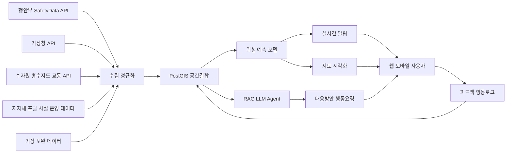
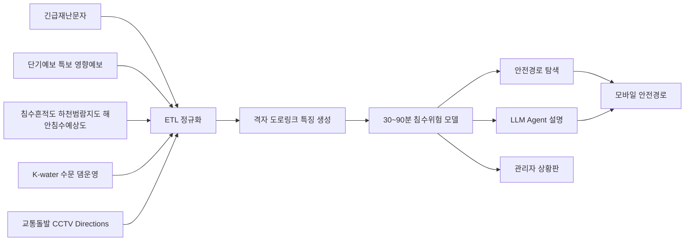

# 재난안전 AI 공공데이터 웹모바일 서비스 제안 보고서

## Executive Summary

공식 서비스 설명과 재난안전데이터 활용 사례를 기준으로 보면, 이미 시장에는 재난문자·국민행동요령·대피시설 조회형 서비스와 “날씨+재난” 통합조회형 사례가 존재하므로, 이번 제품·서비스 개발 부문에서는 개인·기관의 맥락을 반영해 “지금 무엇을 해야 하는지”까지 제시하는 **행동결정형 AI 서비스**가 더 유리하다. citeturn13search0turn13search3turn11search1turn15search5turn14search0

본 보고서의 최종 후보는 **침수퇴로 AI, 사면지킴 코파일럿, 온열버디 AI, 안심통학 레이더, 현장증언 레이더**이며, 최우선 추천안은 행정안전부 긴급재난문자·침수흔적도, 하천범람지도·해안침수예상도, 기상청 예보·특보, K-water 수문정보, 경찰청 돌발·CCTV, Directions API를 가장 촘촘하게 결합할 수 있는 **침수퇴로 AI**다. citeturn4search3turn3search4turn17search1turn12search0turn1search0turn1search1turn2search0turn8search9turn8search1turn9search2

다만 일부 재난 지도는 WMS 중심이거나 비상업적 이용 조건이 붙어 있고, 재난안전데이터 공유플랫폼·일부 교통 API는 활용신청 또는 IP 인증이 필요하므로, 제출용 MVP는 공개형·자동승인 API와 캐시 타일 전략을 우선 채택하고 상용화 전 이용허락을 다시 점검해야 한다. citeturn11search6turn17search1turn12search0turn0search5turn8search5turn8search9

## 설계 원칙과 가정

재난안전데이터 공유플랫폼은 재난관리책임기관 등으로부터 수집·연계된 데이터를 REST 기반 JSON/XML API로 제공하고, 현재 많이 활용되는 데이터로 행정안전부\_긴급재난문자, 경찰청 교통 돌발정보, 저수지 수위, 소방 관련 정보를 전면에 노출하고 있다. 이번 공모에서 경쟁력이 높은 아이템은 “좋은 단일 데이터”보다 **여러 공식 데이터를 같은 상황판단 흐름 안에서 묶는 설계력**을 보여주는 안이다. citeturn0search5turn0search1turn14search0

현재 정부 대표 서비스의 역할은 비교적 선명하다. 안전디딤돌은 긴급재난문자, 재난뉴스, 기상정보, 대피소·무더위쉼터·병원 조회를 제공하고, 생활안전지도는 위험·사고이력과 안전정보를 지도형으로 보여주며, 국민안전24는 재난문자와 각종 안전시설·행동요령을 제공한다. 공식 설명만 놓고 보면 이들은 “정보 접근”에는 강하지만, 개인 동선 최적화, 취약자 맞춤 일정관리, 현장 공무원용 조치 메모 자동화 같은 **행동 결정 지원**은 전면 기능으로 명시돼 있지 않다. 이 공백이 곧 차별화 포인트다. citeturn13search0turn13search3turn11search1

또한 재난안전데이터 공유플랫폼의 공개 활용사례에는 “날씨+재난 통합 서비스”, “외국인을 위한 안전 여행 서비스”, “급경사지 계측 및 관리 솔루션”이 이미 노출돼 있다. 따라서 이번 제안은 단순 통합조회형, 단순 다국어 안내형, 단순 센서 모니터링형과 거리를 두고, **예측·알림·지도·Agent를 한 워크플로우로 묶는 안**만 골랐다. 특히 급경사지 분야는 유사 수상작이 이미 존재하므로, 같은 영역을 택하더라도 “센서 구축”이 아니라 “의사결정 코파일럿”으로 포지셔닝해야 새로움이 살아난다. citeturn15search5turn14search0

가정은 세 가지다. 첫째, 첨부 안내자료 방향에 맞춰 **실데이터와 가상데이터를 혼합**할 수 있다고 보고, 지자체 내부 연락망·건물 취약지점·근로 스케줄처럼 미개방 데이터는 synthetic/mock DB로 보완한다. 둘째, 첨부 포스터 기준 마감까지 시간이 짧으므로, 본 보고서의 **8주 계획은 완성형 MVP 기준**이고 접수 전에는 4주차 수준의 축소 시연본을 먼저 만드는 이중 트랙으로 본다. 셋째, 시연 범위는 전국 단위보다 **침수 취약 1개 구역, 산사태 우려 1개 군, 초등학교 밀집 1개 생활권**처럼 좁게 잡는 편이 현실적이다.

실무적으로는 데이터의 “속도 차이”를 구분해야 한다. 침수흔적도·하천범람지도·해안침수예상도 같은 지도형 재난데이터는 주로 WMS 또는 연 단위 갱신 레이어이므로 실시간 정답이 아니라 **공간 prior**로 써야 하고, 반대로 단기예보·기상특보·K-water 수문정보·교통돌발은 실시간 추론에 적합하다. 또 경찰청 교통소통·교통돌발 API는 키와 IP 인증이 필요한 경우가 있어 모바일 앱에 직접 물리는 것보다 서버 캐시·프록시 구조가 현실적이다. citeturn11search6turn17search1turn12search0turn1search0turn2search0turn8search5turn8search9

아래 흐름도는 위 공공데이터 구조와 첨부 안내자료의 “실데이터+가상데이터+Agent+지도/API 연계” 방향을 기준으로 정리한 공통 아키텍처다. citeturn0search5turn1search0turn4search3turn9search1



## 공통 개발 로드맵

현실적인 공모 대응 방식은 **“제출용 핵심 MVP”와 “8주 완성형 MVP”를 분리**하는 것이다. 제출 전에는 지도, 1종 예측, 1종 알림, 1종 Agent 응답만 살아 있어도 충분히 데모가 가능하고, 8주 안에는 관리자 화면·설명가능성·운영도구까지 확장하면 된다.

| 주차      | 공통 산출물                                                         | 제출용 핵심 여부 |
| --------- | ------------------------------------------------------------------- | ---------------- |
| 첫 주     | 문제 정의, 시연 시나리오 확정, API 키 발급 신청, 데이터 스키마 설계 | 필수             |
| 둘째 주   | PostGIS 적재, 기본 지도, 로그인/권한, 핵심 API 3종 연결             | 필수             |
| 셋째 주   | 1차 위험점수 모델, 규칙 엔진, 가상 보완 데이터 생성                 | 필수             |
| 넷째 주   | AI Agent, 기본 알림, 첫 데모 영상 및 발표 스토리                    | 필수             |
| 다섯째 주 | 경로 탐색 또는 업무 큐 기능, 관리자 화면 고도화                     | 확장             |
| 여섯째 주 | 설명가능성 카드, 모델 보정, 캐시/오프라인 대응                      | 확장             |
| 일곱째 주 | 현장 테스트, 오류 모니터링, 피드백 반영                             | 확장             |
| 여덟째 주 | 디자인 정리, 사업화 자료, 운영 문서, PoC 패키지                     | 확장             |

가장 무난한 팀 구성은 **기획/PM 1명, 프론트 1명, GIS·백엔드 1명, 데이터·AI 1명, 디자이너 0.5명 수준**이다. 모바일을 꼭 네이티브로 만들기보다 PWA 또는 Flutter 단일 코드베이스로 가고, 지도는 Kakao/VWorld/MapLibre 계열, 백엔드는 FastAPI·PostgreSQL/PostGIS·Redis, AI는 Python 기반 LightGBM/XGBoost + RAG LLM 조합으로 잡는 편이 8주 MVP에 유리하다.

업데이트가 빠른 데이터는 기상청 단기예보·특보, 행정안전부 긴급재난문자, K-water 운영정보, 교통돌발/CCTV 쪽이고, 느린 데이터는 침수흔적도·범람지도·보호구역·학교 위치 쪽이다. 따라서 어떤 아이디어든 **느린 데이터는 지도 배경 레이어로, 빠른 데이터는 예측 입력값으로 분리**해 설계해야 성능과 설명 가능성이 모두 살아난다. citeturn1search0turn1search1turn4search3turn2search0turn8search9turn11search6turn17search1turn16search5turn16search6

## 아이디어 제안

아래 순서는 **수상 가능성, 공공데이터 적합성, 8주 시제품 구현 가능성, 사업화 확장성**을 종합해 정렬했다. 다섯 아이디어 모두 웹과 모바일을 함께 상정했으며, 공통적으로 **지도 시각화, AI Agent, 실시간 알림, 위험 예측**을 포함한다.

**가장 추천 | 침수퇴로 AI**  
**프로그램명** 침수퇴로 AI

**해결 문제** 집중호우·하천범람·해안침수 상황에서는 “가까운 대피소”보다 “실제로 도달 가능한 안전 경로”가 더 중요하지만, 시민은 재난문자, 침수 이력, 범람 예상 구역, 교통 통제를 각각 따로 봐야 한다. 특히 저지대·반지하 거주자, 고령자, 차량 운전자, 배달기사, 관광객은 국민안전24 행동요령이 경고하듯 저지대 지하시설을 피해야 함에도 어느 길이 안전한지 즉시 판단하기 어렵다. citeturn13search5turn11search1turn13search0turn13search3

**주요 기능** 홈 화면에서 현재 위치 중심 위험지도를 띄우고, 침수흔적도·하천범람지도·해안침수예상도·실시간 강우·교통 돌발을 겹쳐 본다. AI Agent는 “지금 집에서 나가도 되는가”, “차량을 어디에 옮겨야 하는가”, “가장 안전한 대피소는 어디인가” 같은 질의에 답하고, 앱은 위험 임계값 상향 시 실시간 알림을 보낸다. 핵심은 **안전경로 추천**이다. 가장 빠른 길이 아니라 저지대, 지하차도, 최근 수위 급상승 구간, 사고·통제 구간을 회피한 **퇴로 중심 경로**를 제안하고, 경로 변경 이유를 카드형으로 설명한다. citeturn3search4turn17search1turn12search0turn1search0turn8search9turn8search1turn9search2

**활용 데이터·API** 우선순위는 다음과 같다. 1순위는 행정안전부*긴급재난문자와 행정안전부*침수흔적도, 생활안전지도 하천범람지도·해안침수예상도다. 2순위는 기상청*단기예보 조회서비스와 기상특보 조회서비스다. 3순위는 한국수자원공사*수문 운영 정보·다목적댐 운영 정보다. 4순위는 경찰청*교통돌발정보서비스, 국토교통부\_CCTV 화상자료, 필요 시 경찰청*교통소통정보서비스다. 5순위는 Kakao 지도 API, NAVER Directions 5 또는 VWorld 지도다. 6순위는 지자체 재난포털 공지와 X API Search Posts다. citeturn4search3turn3search4turn17search1turn12search0turn1search0turn1search1turn2search0turn2search6turn8search9turn8search1turn8search5turn9search1turn9search2turn10search6

**AI 활용 방식** 모델은 이중 구조가 적합하다. 첫 번째는 **공간·시계열 위험점수 모델**로, LightGBM 또는 XGBoost를 baseline으로 두고 30~90분 선행 침수위험을 격자와 도로링크 단위로 계산한다. 입력은 누적강우, 초단기실황/단기예보, 특보 여부, 과거 침수흔적 중첩률, 하천범람지도·해안침수예상도 중첩률, 수문/댐 방류량, 교통돌발·CCTV 밀도다. 두 번째는 **RAG 기반 한국어 LLM Agent**로, 공식 행동요령·최근 재난문자·추천 경로 이유를 자연어로 설명한다. 학습은 과거 침수 이력과 수문·기상 이력을 이용하되, 침수흔적도·범람지도·해안침수예상도처럼 연 단위·시나리오형 레이어는 실시간 truth가 아니라 **공간 prior**로만 사용해야 한다. 온디바이스는 작은 규칙 엔진만 둬서 마지막 수신 경로·대피소를 오프라인 캐시하고, 설명가능성은 SHAP 상위 요인과 “왜 이 길을 막았는가” 카드를 함께 보여주는 방식이 현실적이다. citeturn11search6turn17search7turn12search0turn1search0turn2search0turn8search9

**차별점** 안전디딤돌·국민안전24·생활안전지도는 각각 재난문자, 행동요령, 안전시설, 위험이력 지도에 강점이 있지만, 공식 설명상 사용자의 출발지·도착지·교통상황·침수 레이어를 한 번에 묶어 **실시간 안전경로**를 계산해 주는 구조는 전면 기능으로 제시돼 있지 않다. 침수퇴로 AI는 “알림 앱”이 아니라 “대피 경로 엔진”이라는 점에서, 기존 서비스 위에 얹는 보완재가 아니라 **의사결정 계층**으로 차별화된다. citeturn13search0turn13search3turn11search1turn9search2

**MVP 구현 방법** 기술스택은 웹을 Next.js 또는 React, 모바일을 Flutter 또는 PWA, 지도는 MapLibre+VWorld/Kakao, 백엔드는 FastAPI+PostgreSQL/PostGIS+Redis, AI는 Python 기반 LightGBM+RAG LLM으로 잡으면 된다. 필요 인력은 4명 내외가 적당하고, 8주 중 앞 4주는 API 연결·지도·기본 위험점수·Agent 응답만 구현해 제출용 시연본을 만들고, 뒤 4주에서 경로 추천·캐시·관리자 화면을 붙인다. 핵심 화면은 홈 지도, “지금 대피” 카드, 경로 내 CCTV/통제 패널, AI 질문창, 관리자 대시보드이며, 데이터 파이프라인은 **API 수집 → 공간 정규화 → 격자/도로 특징 생성 → 위험예측 → 경로탐색 → 알림/설명 출력** 순으로 잡는 것이 현실적이다. WMS 재난지도는 서버에서 관심구역 래스터 캐시로 전처리하고, 교통은 돌발정보·CCTV를 우선 연결한 뒤 IP 인증형 소통정보는 후속 연계하는 편이 제출 일정에 맞다. citeturn11search6turn17search1turn12search0turn8search1turn8search9turn8search5

**사업화 가능성** 1차 고객은 침수 취약 지자체, 공공주택·아파트 관리단지, 물류·배달기업, 산업단지 운영사다. 수익모델은 B2G 연간 구독형 상황판, B2B 임직원 안전모듈, API/대시보드 커스터마이징, 재난 훈련용 시뮬레이션 패키지로 나누기 좋다. 확장 전략도 분명하다. 같은 엔진으로 태풍, 해안침수, 대설 시 **안전동선 서비스**로 넓힐 수 있기 때문이다. 다만 상용 계약 전에 지도 레이어별 이용허락 범위 재검토 또는 대체 데이터 병행이 필요하다. citeturn0search5turn11search6

침수퇴로 AI의 데이터 파이프라인은 아래처럼 설계하면 8주 MVP 범위 안에 들어온다. 핵심은 WMS 재난지도를 PostGIS에서 빠른 신호와 결합해 “격자 위험도 → 도로 링크 위험도 → 안전 경로”로 번역하는 것이다. citeturn11search6turn17search1turn12search0turn1search0turn2search0turn8search9



아래 와이어프레임은 제출용 MVP에서 바로 보여주기 좋은 최소 화면 구성이다. 재난문자, 위험지도, 대피시설, 경로를 한 화면에 묶어야 “왜 기존 재난 앱과 다른가”가 심사장에서 즉시 보인다. citeturn13search0turn13search3turn11search1turn8search9

```text
┌───────────────────────────────┐
│ 침수퇴로 AI                   │
│ [현재위치] [집] [회사] [AI]   │
├───────────────────────────────┤
│ 지도: 위험셀 + 통제구간 + CCTV│
│  🔴 침수예상  🟠 주의  🟢 안전│
│                               │
│  ▶ 안전경로 시작              │
├───────────────────────────────┤
│ 위험요약: 30분 후 경계        │
│ 원인: 누적강우↑ 수위↑ 통제발생│
│ 추천: A대피소 대신 B고지대    │
├───────────────────────────────┤
│ [대피소] [재난문자] [질문하기] │
└───────────────────────────────┘
```

**강한 대안 | 사면지킴 코파일럿**  
**프로그램명** 사면지킴 코파일럿

**해결 문제** 군·구 재난담당자와 시설관리자는 산사태 예보, 강우 임계치, 도로변 산사태 취약구간, CCTV, 재난문자, 내부 연락망을 동시에 확인해야 하지만 실제로는 창이 여러 개로 흩어져 있다. 산림청은 산사태 예보발령 정보와 도로변산사태 정보를 공개하고, 생활안전지도는 산사태위험지도와 발생이력을 제공하지만, 현장 공무원이 즉시 써먹을 “지금 가장 위험한 3곳과 해야 할 일”까지 한 번에 정리해 주는 화면은 공식 서비스 설명에서 전면화돼 있지 않다. citeturn6search2turn15search8turn15search10turn17search2turn13search3

**주요 기능** 지도에서 위험지구, 도로 접근로, 보호가 필요한 시설을 한 화면에 묶고, AI Agent가 “현재 1시간 강우 45mm일 때 우선 통제해야 할 급경사지와 연락 대상은?” 같은 질의에 즉시 답한다. 실시간 알림은 산사태 예보 단계 상향, 강우 임계치 도달, CCTV 우선 확인 순서 변경 때 발생하며, 위험 예측은 단순 확률이 아니라 **조치 리스트형 출력**으로 제공한다. 또한 공무원 모드에서는 문자 초안, 주민안내문, 상황보고서 초안, 현장점검 체크리스트를 자동 생성한다. citeturn6search2turn1search0turn1search1turn4search3

**활용 데이터·API** 1순위는 산림청*산사태 예보발령 정보와 산사태위험지도, 도로변산사태 정보다. 2순위는 기상청*단기예보 조회서비스, 기상특보 조회서비스, 필요 시 영향예보다. 3순위는 행정안전부*긴급재난문자와 지자체 재난포털 공지다. 4순위는 경찰청*교통돌발정보서비스와 국토교통부\_CCTV 화상자료다. 5순위는 VWorld WebGL 3D 지도 API다. 6순위는 내부 연락망·취약시설 정보인데, 이는 첨부 안내자료 취지에 맞춰 가상 데이터로 보완 가능하다고 가정한다. citeturn6search2turn15search8turn15search10turn1search0turn1search1turn4search3turn8search9turn8search1turn9search4

**AI 활용 방식** 핵심은 **하이브리드 룰+랭킹 모델**이다. 산사태처럼 설명책임이 큰 분야에서는 완전 블랙박스보다 공식 예보/임계치의 룰 계층을 살리고, 그 위에 중요도 랭킹 모델을 얹는 편이 설득력이 높다. 입력은 강우량, 특보, 산사태 예보 단계, 위험지도 중첩률, 도로 접근성, 취약시설 수, 최근 재난문자 패턴이다. 출력은 단계 판정, 우선 확인 CCTV, 즉시 대피 권고 지역, 연락 순서, 보고서 초안이다. 학습은 과거 예보 이력과 synthetic 상황자료를 함께 쓰고, 추론은 5~10분 주기 서버 추론이 적합하다. 온디바이스는 필수는 아니지만, 현장 공무원용 앱에는 마지막 체크리스트와 연락망을 오프라인 저장하는 것이 유용하다. 설명가능성은 **“임계치 비교표 + 근거 데이터 링크 + 추천 이유”**를 동시에 노출하는 방식이 좋다.

**차별점** 재난안전데이터 활용사례에 이미 “급경사지 계측 및 관리 솔루션” 수상작이 공개되어 있으므로, 동일한 “센서/디지털트윈 감시” 포지션으로 들어가면 새로움이 약해질 수 있다. 사면지킴 코파일럿은 하드웨어 경쟁이 아니라 **지자체 재난담당자의 판단·연락·보고 workflow를 줄여 주는 소프트웨어**라는 점을 분명히 해야 차별성이 선다. citeturn14search0

**MVP 구현 방법** 웹 우선 전략이 맞다. VWorld 3D 또는 2D 지도를 올린 대시보드와, 현장용 모바일 체크리스트 앱을 함께 만드는 방식이 가장 실용적이다. 기술스택은 Next.js/React, FastAPI, PostGIS, Redis, LLM RAG를 추천하고, 인력은 PM 1, GIS/백엔드 1, 프론트 1, 데이터·AI 1 정도면 충분하다. 핵심 화면은 지자체 대시보드, 위험지구 상세, AI 조치 추천창, 상황보고 로그, 연락망 화면이다. 데이터 파이프라인은 **예보/강우/지도/도로/문자 수집 → 위험지구 스코어링 → 우선순위 랭킹 → 조치 문안 생성**으로 단순명료하게 잡는 편이 낫다.

**사업화 가능성** 지자체 안전총괄부서, 산림부서, 지방도로 관리기관, 관광지·캠핑장 운영사, 철도·전력 인프라 운영기관이 주요 고객이다. 수익모델은 B2G 라이선스와 SOP 커스터마이징, 재난훈련용 AI 시뮬레이션, 현장점검 모바일 앱 추가 과금으로 설계할 수 있다. 확장도 쉽다. 같은 구조를 급경사지, 낙석, 싱크홀, 대설 통제에도 전용할 수 있기 때문이다.

**빠른 상용화형 | 온열버디 AI**  
**프로그램명** 온열버디 AI

**해결 문제** 폭염 대응은 물리적 대피소만으로 끝나지 않는다. 독거노인, 야외근로자, 배달기사, 건설현장 관리자, 지자체 복지 담당자는 “오늘 몇 시에 쉬어야 하는지, 누구에게 먼저 연락해야 하는지, 어느 쉼터가 가장 가까운지”를 시간대별로 판단해야 한다. 기상청 영향예보는 폭염 위험 수준과 분야별 대응요령을 제공하고, 행정안전부는 무더위쉼터 데이터를 제공하며, 질병관리청은 온열질환 응급실감시체계를 운영하지만, 이 세 데이터를 한데 묶어 **개인별 행동 일정표**로 바꾸는 서비스는 여전히 비어 있다. citeturn6search3turn4search0turn7search0turn7search4turn13search9

**주요 기능** 지도 시각화는 생활권 단위 체감·위험도 지도, 쉼터 지도, 이동 가능 시간대를 함께 보여준다. AI Agent는 “오후 2시부터 5시까지 외부작업이 예정된 67세 작업자”처럼 사용자 프로필이 있는 질문에 맞춤형 답을 내놓고, 실시간 알림은 위험 수준 상승, 체감온도 급등, 작업시간 연속 초과, 쉼터 접근 가능 시간 기준으로 발송한다. 위험 예측은 개인별로 **다음 4시간 안전 계획표**를 제시하는 형태가 효과적이다. 관리자 모드에는 팀별 위험 순위, 안부전화 우선 리스트, 누가 벌써 위험 단계인지 보여주는 화면이 필요하다. citeturn6search3turn6search10turn4search0turn7search0

**활용 데이터·API** 1순위는 기상청*영향예보*조회서비스와 단기예보 조회서비스, 기상특보 조회서비스다. 특히 영향예보는 위험단계와 대응요령을 제공하고, 2026년 5월 변경으로 내일·모레 예보를 함께 다룰 수 있어 48시간 행동계획용으로 적합하다. 2순위는 행정안전부*무더위쉼터다. 3순위는 질병관리청 온열질환 응급실감시체계와 건강위해 통합정보시스템의 온열질환 예측 정보다. 4순위는 Kakao 지도 API와 NAVER Directions 5다. 5순위는 소방청*구급정보서비스 및 119 구급통계류를 보조 학습 데이터로 활용할 수 있다. citeturn6search3turn6search10turn1search0turn1search1turn4search0turn7search0turn7search4turn9search1turn9search2turn18search1

**AI 활용 방식** 모델은 **개인화 위험점수 모델 + LLM 일정 추천 Agent**가 적합하다. 입력은 시간대별 예보, 영향예보 위험단계, 사용자 연령·기저질환 여부·근무형태·실외 노출 시간·이동수단·쉼터 접근성·자가증상이다. 출력은 개인별 위험점수, 다음 휴식 시각, 권장 수분 섭취, 인근 쉼터, 작업 중단 권고, 복지 담당자 안부전화 우선순위다. 학습은 날씨와 지역별 온열질환 발생 추세를 이용한 지도학습으로 하되, 질병청 감시자료는 개인 진단용이 아니라 **집단 위험 보정용**으로 쓰는 것이 안전하다. 온디바이스는 증상 체크와 긴급 행동요령 룰 엔진 정도면 충분하고, 설명가능성은 “왜 고위험인가”를 체감온도·노출시간·고령·특보 조합으로 카드화하면 된다. citeturn7search0turn7search4turn6search3

**차별점** 현재 안전디딤돌·국민안전24는 무더위쉼터와 행동요령을 안내하고, 기상청 영향예보는 위험단계와 대응요령을 제공한다. 온열버디 AI의 차별점은 그 정보를 **일정 추천·안부전화 우선순위·현장 관리자용 교대표 조정**으로 바꾸는 데 있다. 즉 “폭염 정보”가 아니라 “폭염 운영도구”다. citeturn13search0turn13search9turn6search3turn4search0

**MVP 구현 방법** 구현 난이도는 다섯 안 중 가장 낮은 편이다. 웹 관리자 대시보드와 모바일 사용자 앱만 있어도 시연이 가능하고, 위험모델도 복잡한 공간 그래프보다 표준 tabular 모델로 먼저 시작할 수 있다. 핵심 화면은 오늘의 위험도 카드, 시간대별 작업·휴식 일정표, 인근 쉼터 지도, AI Q&A, 관리자 위험 순위표다. 데이터 파이프라인은 **예보/영향예보 수집 → 개인 프로필 결합 → 위험점수 계산 → 일정 추천 → 알림 발송**으로 직관적이다. 인력은 3~4명, 개발 기간은 6~8주면 충분하다.

**사업화 가능성** 지자체 복지부서, 건설사, 물류사, 대형 대학·캠퍼스, 공공기관 시설관리 부서가 주요 타깃이다. 수익모델은 B2G 취약계층 모니터링 SaaS, B2B 근로자 안전관리 모듈, ESG·안전리포트 부가상품으로 설계할 수 있다. 이후 한파 대응까지 확장하면 계절성도 완화된다.

**생활밀착형 | 안심통학 레이더**  
**프로그램명** 안심통학 레이더

**해결 문제** 학부모와 학교는 “가장 빠른 길”이 아니라 “가장 안전한 등굣길”을 원하지만, 현재는 어린이보호구역 위치, 학교 위치, 어린이 교통사고 다발지역, 실시간 교통돌발, 폭우·폭염 등을 각각 अलग로 확인해야 한다. 경찰청은 전국 보호구역 geometry를 공개하고, 한국교육시설안전원 표준데이터는 전국 초중등학교 위치를 제공하며, 도로교통공단은 어린이보호구역·보행어린이 사고다발지역을 공개한다. 즉 필요한 데이터는 이미 있는데, 이를 통학 시간과 아동 모드로 결합한 제품이 드물다. citeturn16search6turn16search5turn8search2turn8search3turn8search9

**주요 기능** 지도 시각화는 학교, 보호구역, 사고다발지역, 현재 교통돌발, 기상위험, 침수 위험을 겹쳐 보여준다. AI Agent는 “오늘 비 오는 날 초등학교 3학년 도보 통학에 가장 안전한 출발 시간과 경로는?” 같은 질문에 답하고, 실시간 알림은 사고다발구간 우회 필요, 특보 발효, 학교 주변 도로 통제, 갑작스런 강우 급증 때 발송된다. 위험 예측은 단순 전체지도보다 **출발지-학교 경로별 안전 점수**가 핵심이다. 학교 모드에서는 반별 귀가 위험도, 귀가시간 권고, 통학버스 픽업 포인트 안전점검 화면까지 확장할 수 있다. citeturn8search2turn8search3turn8search9turn1search0turn1search1turn3search4

**활용 데이터·API** 1순위는 경찰청*전국 보호구역 현황과 전국초중등학교위치표준데이터다. 2순위는 한국도로교통공단*어린이보호구역내 어린이 교통사고 다발지역, 보행어린이 교통사고 다발지역이다. 3순위는 경찰청*교통돌발정보서비스와 필요 시 교통소통정보서비스, 국토교통부\_CCTV 화상자료다. 4순위는 기상청 단기예보·기상특보다. 5순위는 행정안전부*침수흔적도와 지역별 무더위쉼터다. 6순위는 Kakao 지도 API와 NAVER Directions 5다. citeturn16search6turn16search5turn8search2turn8search3turn8search9turn8search5turn8search1turn1search0turn1search1turn3search4turn4search0turn9search1turn9search2

**AI 활용 방식** 모델은 **경로 랭킹 모델**이 가장 어울린다. 입력은 보호구역 여부, 사고다발지역 중첩, 시간대, 교통돌발, 강우/폭염, 보도 폭 추정, CCTV 설치 여부, 횡단보도 밀집도 같은 경로 특징이다. 출력은 경로별 안전점수, 추천 출발시간, 피해야 할 블록, 학교별 위험 알림이다. 학습은 과거 사고 hotspot과 계절·시간 변수로 가능하고, 추론은 출발 전 1회와 이상상황 발생 시 재계산 구조가 현실적이다. 온디바이스는 마지막 안전경로와 긴급 연락처 캐시 정도면 충분하며, 설명가능성은 “이 길을 빼는 이유”를 보호구역·사고이력·폭우 리스크로 설명하면 된다.

**차별점** 내비게이션 서비스는 일반적으로 빠르거나 실시간 교통을 반영한 길 찾기에 강하고, 공식 재난 서비스는 시설·위험 정보를 보여주는 데 강하다. 안심통학 레이더는 둘 사이를 연결해 **아동 맞춤 안전경로**를 계산한다는 점이 다르다. 즉 학교·학부모 입장에서는 완전히 새로운 “통학 모드”가 되는 셈이다. citeturn13search0turn13search3turn9search2

**MVP 구현 방법** 1개 구·군 기준으로 학교 20~30개, 학부모 출발지 샘플 200개 정도만 잡으면 시연은 충분하다. 기술스택은 침수퇴로 AI와 거의 동일하되, 모델 부분을 graph router나 learning-to-rank에 맞게 단순화하면 된다. 핵심 화면은 학부모 홈, 오늘의 통학 위험도, 안전경로 비교, 학교 관리자 화면, AI 질문 화면이다. 데이터 파이프라인은 **학교/보호구역/사고 hotspot 적재 → 실시간 교통·기상 결합 → 경로 스코어링 → 추천/알림**으로 설계한다. 인력은 3~4명, 개발기간은 6~8주가 적정하다.

**사업화 가능성** 지자체 교육·안전 부서, 초등학교, 학원차 운영사, 어린이 보험사, 스마트시티 실증사업이 직접 고객이 될 수 있다. 수익모델은 학교/지자체 구독형과 보험사 제휴형이 적합하다. 추가 확장으로는 노인보호구역·장애인보호구역 안전동선 서비스까지 연결할 수 있다.

**고난도 차별화형 | 현장증언 레이더**  
**프로그램명** 현장증언 레이더

**해결 문제** 지자체 상황실과 대형시설 운영사는 공식 재난문자나 보고가 뜨기 전에 현장 이상징후를 빨리 감지하고 싶어 한다. 로컬 화재 연기, 도로침수, 싱크홀 의심, 산불 비산, 화학 누출 같은 사건은 시민 게시물, 현장 사진, 교통통제, CCTV, 날씨 변화가 먼저 신호를 낼 때가 있지만, SNS 단독 신호는 노이즈가 많다. X API는 검색형 Posts API를 제공하고 pay-per-use 구조로 실시간 공공대화 접근을 지원하므로, 이를 행정안전부 재난문자·경찰청 돌발·CCTV와 교차검증하는 **약신호 탐지 도구**를 만들 수 있다. citeturn10search6turn10search2turn10search9turn4search3turn8search9turn8search1

**주요 기능** 지도 시각화는 사건 클러스터, 공식 확인 여부, CCTV 근접도, 기상 조건을 동시에 보여준다. AI Agent는 여러 게시물·문자·돌발정보를 묶어서 “현재 OO동에서 연기 민원이 다수 발생했고, 풍향상 남동쪽 확산 가능성이 있어 학교·요양시설 우선 점검 필요” 같은 상황브리프를 만든다. 실시간 알림은 **SNS 단독**으로 보내지 않고, 일정 점수 이상 클러스터가 형성되고 공식 데이터 또는 CCTV 연계 근거가 최소 1종 이상 붙을 때만 발송하는 구조가 바람직하다. 위험 예측은 사건 종류별로 “확산 가능성/신뢰도/우선 대응 대상”을 추정하는 방식이 실용적이다. citeturn10search6turn11search3turn8search9turn8search1

**활용 데이터·API** 1순위는 X API Search Posts와 필요 시 스트리밍 계열이다. 2순위는 행정안전부*긴급재난문자와 국민안전24 재난문자 페이지다. 3순위는 경찰청*교통돌발정보서비스와 국토교통부*CCTV 화상자료다. 4순위는 기상청*기상특보·단기예보, 특히 풍향·강수 정보를 포함한 관측/예보다. 5순위는 지자체 재난포털 공지와 안전관리일일상황류다. 6순위는 Kakao 지도 API와 지오코딩/다이렉션 계열이다. 보조로 소방 관련 공개데이터를 붙여 사후 검증 모델을 강화할 수 있다. citeturn10search6turn10search2turn4search3turn11search3turn8search9turn8search1turn1search1turn1search0turn11search1turn9search1turn18search0

**AI 활용 방식** 모델은 세 층으로 나누는 것이 안전하다. 첫 번째는 **한국어 재난 게시물 분류기**로 사건 유형과 긴급도를 분류한다. 두 번째는 **지오코딩·클러스터링 모델**로 여러 게시물에서 장소를 뽑고 중복을 제거한다. 세 번째는 **신뢰도 점수 모델**로 공식 문자·교통돌발·기상상황과의 일치 여부를 반영한다. 그 위에 LLM Agent가 상황브리프를 만든다. 학습은 과거 게시물·문자·언론명사 없이도 synthetic post generation으로 충분히 초기화할 수 있고, 추론은 스트리밍 또는 1분 단위 배치로 설계하면 된다. 온디바이스는 필수는 아니며, 설명가능성은 “어떤 공식 근거가 붙었는가”를 명시적으로 보여줘야 한다.

**차별점** 안전디딤돌·국민안전24는 본질적으로 **공식 확인된 정보 전달 체계**다. 현장증언 레이더는 그 이전 단계에서 약한 신호를 감지하되, 단독으로 결론 내리지 않고 공식 데이터와 교차검증하는 “보조 상황인식 계층”이라는 점이 다르다. 즉 오탐을 허용하는 감시가 아니라, **확인 우선순위를 정하는 운영 도구**다. citeturn13search0turn11search1turn11search3

**MVP 구현 방법** 다섯 안 중 구현 리스크가 가장 높다. 이유는 모델보다 운영정책이 더 중요하기 때문이다. 개인정보 마스킹, 허위정보 대응, 도시명/동명 오인식 처리, X API 과금 제어가 모두 필요하다. 따라서 MVP는 전국판이 아니라 1개 도시·1개 유형, 예를 들어 “도시 화재·연기 + 교통통제 + 기상특보”에만 좁혀야 한다. 핵심 화면은 상황실 지도, 사건 클러스터 타임라인, AI 요약창, CCTV·공식문자 근거 패널이며, 데이터 파이프라인은 **SNS 수집 → 분류·지오코딩 → 클러스터링 → 공식데이터 교차검증 → 상황브리프 생성 → 알림**이다. 인력은 최소 4명, 개발 기간은 8주가 적정하다. citeturn10search2turn10search6

**사업화 가능성** 사업성 자체는 높다. 지자체 상황실, 캠퍼스, 산업단지, 대형 행사장, 철도·공항 운영기관 같은 운영 조직은 모두 약신호 감지 수요가 있다. 수익모델은 monitored-zone 구독형, 사고유형별 모듈 과금, 프리미엄 분석 리포트로 가져갈 수 있다. 다만 초기에는 운영비와 검증 비용이 있어, 단독 스타트업 SaaS보다 공공 PoC 또는 대기업/기관 협업형이 더 현실적이다. citeturn10search2

## 비교 평가

아래 점수는 **독창성, 데이터 활용성, 구현 가능성, 공익성, 사업성, 수상 가능성**을 각각 1점에서 5점으로 평가한 것이다. 점수는 제출 시연 임팩트, 신규성, 공식 데이터 결합 폭, 이후 공공조달·기업 판매 가능성을 종합해 매겼다.

| 아이디어          | 독창성 | 데이터 활용성 | 구현 가능성 | 공익성 | 사업성 | 수상 가능성 | 총점 |
| ----------------- | -----: | ------------: | ----------: | -----: | -----: | ----------: | ---: |
| 침수퇴로 AI       |      5 |             5 |           4 |      5 |      5 |           5 |   29 |
| 사면지킴 코파일럿 |      4 |             5 |           4 |      5 |      5 |           5 |   28 |
| 온열버디 AI       |      4 |             5 |           5 |      5 |      4 |           4 |   27 |
| 안심통학 레이더   |      4 |             4 |           5 |      5 |      4 |           4 |   26 |
| 현장증언 레이더   |      5 |             4 |           3 |      4 |      5 |           3 |   24 |

점수 차이가 생긴 이유는 분명하다. 침수퇴로 AI와 사면지킴 코파일럿은 재난안전 공공데이터의 밀도가 높고, 지자체가 바로 사고 싶은 그림을 만들기 쉽다. 반면 현장증언 레이더는 매우 새롭지만 X API가 pay-per-use 구조라 운영비·검증비가 변수이고, 심사장에서 “허위정보를 어떻게 막을 것인가”라는 질문을 반드시 받게 된다. citeturn10search2turn10search6

또한 수상 확률 관점에서 보면, “날씨+재난” 정도의 단순 통합조회형은 이미 공개 활용사례가 있어 상대적으로 신선도가 떨어진다. 따라서 이번 공모에서는 **정보를 보여주는 수준을 넘어 행동과 업무를 바꾸는 안**이 더 유리하다. citeturn15search5turn14search0

## 최종 권고

최종 1위는 **침수퇴로 AI**다. 행정안전부 재난문자·침수흔적도, 하천범람지도·해안침수예상도, 기상청 예보·특보, K-water 수문정보, 교통 돌발·CCTV를 한 서비스에서 가장 자연스럽게 결합할 수 있고, 기존 정부 서비스의 재난문자·위험지도·대피시설 정보를 **실제 이동 의사결정**으로 바꾼다는 점에서 데모 설득력이 가장 크다. 동시에 시민용 모바일, 지자체 상황판, 시설관리자 B2B 모듈로 분기되는 사업 스토리까지 가장 명확하다. citeturn4search3turn3search4turn17search1turn12search0turn1search0turn2search0turn8search9turn13search0turn13search3
